# Technical PM Command Center: EVM Dashboard

**Project Manager:** Younes Boutelidjane

---

## Executive Summary

In today's fast-paced software development landscape, **budget overruns and schedule delays** are among the top risks facing technical projects. This Technical PM Command Center leverages **Earned Value Management (EVM)** principles to provide real-time visibility into project health, enabling proactive decision-making before issues escalate.

**How I use this tool to prevent budget overruns:**

1. **Early Warning System**: By monitoring CPI (Cost Performance Index) and SPI (Schedule Performance Index) in real-time, the dashboard flags cost and schedule variances before they become critical.

2. **Predictive Analytics**: The Estimate at Completion (EAC) calculation forecasts final project costs based on current performance trends, allowing for early budget adjustments.

3. **Resource Optimization**: Automated detection of over-allocated resources (>3 concurrent tasks) prevents burnout and ensures optimal team productivity.

4. **Risk-Driven Prioritization**: Visual risk heatmaps enable data-driven decisions on where to focus mitigation efforts across departments.

5. **Stakeholder Transparency**: Professional, executive-ready reports transform raw data into actionable insights for both technical and non-technical audiences.

**Result**: Projects stay on budget, on schedule, and aligned with strategic objectives through continuous monitoring and data-driven course corrections.

---

## Architecture Diagram

```mermaid
flowchart LR
    A[📄 project_data.csv] --> B[🐍 Python Analysis Engine]
    C[📋 milestones.json] --> B
    B --> D[📊 EVM Calculations]
    D --> E[CPI/SPI Metrics]
    D --> F[EAC Predictions]
    B --> G[🔍 Resource Analysis]
    G --> H[Allocation Reports]
    B --> I[⚠️ Risk Analysis]
    I --> J[Risk Heatmap]
    E --> K[📈 Stakeholder Reports]
    F --> K
    H --> K
    J --> K
    K --> L[👔 Executive Dashboard]
    K --> M[📊 Visual Charts]
    M --> N[budget_report.png]
    M --> O[risk_heatmap.png]
```



**Data Flow:**
1. **Input Layer**: CSV project data and JSON milestone tracking
2. **Analysis Engine**: Python-based calculations and aggregations
3. **Metrics Layer**: EVM calculations, resource analysis, risk assessment
4. **Output Layer**: Professional reports and visualizations for stakeholders

---

## Features

### 📊 Earned Value Management (EVM)
- **CPI (Cost Performance Index)**: Measures cost efficiency
- **SPI (Schedule Performance Index)**: Measures schedule adherence
- **EAC (Estimate at Completion)**: Predicts final project cost
- **VAC (Variance at Completion)**: Forecasts budget surplus/deficit

### 🔍 Resource Management
- Tracks resource allocation across all active tasks
- Identifies over-allocated team members (>3 concurrent tasks)
- Provides department-level resource distribution

### ⚠️ Risk Visualization
- Risk heatmap by department and severity level
- Visual identification of high-risk areas
- Data-driven risk mitigation prioritization

### 🎯 Milestone Tracking
- JSON-based milestone management
- Dependency tracking between milestones
- Status monitoring (Completed, In Progress, Not Started)

### 📈 Professional Reporting
- Executive-ready formatted tables using `tabulate`
- Multi-dimensional visualizations with `matplotlib` and `seaborn`
- Color-coded status indicators for quick assessment

---

## Key Insights: Understanding EVM Metrics for Non-Technical Stakeholders

### What is CPI (Cost Performance Index)?

**Simple Definition**: CPI tells you if you're getting your money's worth.

- **CPI > 1.0**: ✅ **Good News!** You're spending less than planned for the work completed. The project is **under budget**.
  - *Example*: CPI of 1.10 means you're getting $1.10 worth of work for every $1.00 spent.

- **CPI = 1.0**: ✔️ **On Track** - Spending exactly as planned.

- **CPI < 1.0**: ⚠️ **Attention Needed** - You're spending more than planned for the work completed. The project is **over budget**.
  - *Example*: CPI of 0.90 means you're only getting $0.90 worth of work for every $1.00 spent.

**Formula**: `CPI = Earned Value (work completed) ÷ Actual Cost (money spent)`

---

### What is SPI (Schedule Performance Index)?

**Simple Definition**: SPI tells you if you're on schedule.

- **SPI > 1.0**: ✅ **Ahead of Schedule** - You've completed more work than planned at this point.
  - *Example*: SPI of 1.15 means you're 15% ahead of schedule.

- **SPI = 1.0**: ✔️ **On Schedule** - Progress matches the plan.

- **SPI < 1.0**: ⚠️ **Behind Schedule** - You've completed less work than planned.
  - *Example*: SPI of 0.85 means you're 15% behind schedule.

**Formula**: `SPI = Earned Value (work completed) ÷ Planned Value (work scheduled)`

---

### What is EAC (Estimate at Completion)?

**Simple Definition**: EAC predicts the total cost when the project finishes, based on current performance.

- If your **CPI is 0.90** (over budget), the EAC will be **higher** than your original budget.
- If your **CPI is 1.10** (under budget), the EAC will be **lower** than your original budget.

**Why It Matters**: EAC gives you an early warning if you need to request additional budget or can return funds.

**Formula**: `EAC = Budget at Completion ÷ CPI`

---

### Real-World Example

**Scenario**: You have a $100,000 project.

- **Planned Value (PV)**: $50,000 (you should be 50% done)
- **Earned Value (EV)**: $40,000 (you're actually 40% done)
- **Actual Cost (AC)**: $55,000 (you've spent $55,000)

**Calculations**:
- **CPI** = $40,000 ÷ $55,000 = **0.73** ⚠️ (Over budget - getting only $0.73 of value per $1 spent)
- **SPI** = $40,000 ÷ $50,000 = **0.80** ⚠️ (Behind schedule - only 80% of planned work completed)
- **EAC** = $100,000 ÷ 0.73 = **$137,000** ⚠️ (Project will likely cost $37,000 more than budgeted)

**Action**: With this data, I can immediately:
1. Investigate why costs are high (inefficiencies, scope creep)
2. Reallocate resources to catch up on schedule
3. Inform my stakeholders early about potential budget needs
4. Implement corrective actions before it's too late

---

## Installation

### Prerequisites
- Python 3.8+
- pip package manager

### Setup

```bash
# Navigate to project directory
cd /home/jonas/Desktop/pm-automation-engine

# Create virtual environment
python3 -m venv venv

# Activate virtual environment
source venv/bin/activate  # On Linux/Mac
# OR
venv\Scripts\activate  # On Windows

# Install dependencies
pip install pandas matplotlib seaborn tabulate
```

---

## Usage

### Running the Dashboard

```bash
# Ensure virtual environment is activated
source venv/bin/activate

# Run the command center
python pm_dashboard.py
```

### Expected Outputs

1. **Console Reports**:
   - Executive Summary with overall CPI, SPI, EAC
   - Performance Indicators with status
   - Task-level performance details
   - Resource allocation analysis
   - Milestone tracking status

2. **Visual Reports**:
   - `budget_report.png` - Budget vs Actual vs Earned Value comparison
   - `risk_heatmap.png` - Risk distribution by department

---

## File Structure

```
pm-automation-engine/
├── pm_dashboard.py          # Main dashboard script
├── project_data.csv         # Project task data (15 tasks)
├── milestones.json          # Milestone tracking data
├── README.md                # This file
├── budget_report.png        # Generated: Budget analysis chart
├── risk_heatmap.png         # Generated: Risk visualization
└── venv/                    # Virtual environment (created during setup)
```

---

## Data Files

### project_data.csv
Contains 15 project tasks with the following columns:
- `Task_Name`: Name of the task
- `Planned_Value`: Budgeted cost (PV)
- `Actual_Cost`: Money spent (AC)
- `Earned_Value`: Value of work completed (EV)
- `Status`: Completed / In Progress
- `Department`: Engineering / QA / Design / DevOps
- `Resource_Name`: Assigned team member
- `Risk_Level`: 1 (Low) to 5 (Critical)
- `Estimated_Completion_Date`: Target completion date

### milestones.json
Tracks 8 key technical milestones:
- Architecture Sign-off
- Development Environment Setup
- Core API Development Complete
- Security Penetration Testing
- UAT Completion
- Performance Benchmarking
- Production Deployment
- Post-Launch Monitoring

---

## Interpreting Dashboard Results

### 🎯 Performance Indicators

| Metric | Good | Caution | Action Needed |
|--------|------|---------|---------------|
| **CPI** | > 1.0 | 0.9 - 1.0 | < 0.9 |
| **SPI** | > 1.0 | 0.9 - 1.0 | < 0.9 |
| **Risk Level** | 1-2 | 3 | 4-5 |
| **Resource Tasks** | ≤ 3 | 4 | > 4 |

### 📊 Visual Analysis

- **Budget Report**: Compare the three bars (PV, AC, EV) for each task
  - EV < AC = Over budget on that task
  - EV < PV = Behind schedule on that task

- **Risk Heatmap**: Darker colors indicate higher concentration of risk
  - Focus mitigation efforts on departments with level 4-5 risks

---

## Technical Details

### Code Quality
- **PEP8 Compliant**: Follows Python style guidelines
- **Comprehensive Docstrings**: All functions documented
- **Modular Design**: Separation of concerns for maintainability
- **Error Handling**: Graceful handling of missing files

### Dependencies
- `pandas`: Data manipulation and analysis
- `matplotlib`: Chart generation
- `seaborn`: Statistical visualizations
- `tabulate`: Professional table formatting

---

## Portfolio Highlights

This project demonstrates:

✅ **Technical PM Expertise**: Deep understanding of EVM methodology  
✅ **Python Proficiency**: Data analysis, visualization, and automation  
✅ **Data-Driven Decision Making**: Transforming raw data into actionable insights  
✅ **Stakeholder Communication**: Executive-ready reporting for technical and non-technical audiences  
✅ **Software Engineering Best Practices**: Clean code, documentation, modular design  
✅ **Risk Management**: Proactive identification and visualization of project risks  
✅ **Resource Management**: Optimization of team allocation and workload balancing  

---

## About Me

**Younes Boutelidjane** - Project Manager

This Technical PM Command Center showcases my intersection of technical expertise and project management acumen. It demonstrates my ability to build tools that drive project success through data-driven insights and proactive risk management.

---

## License

This project is part of my professional portfolio.

---

## Future Enhancements

- Integration with project management APIs (Jira, Asana)
- Real-time dashboard with web interface
- Automated email reports to stakeholders
- Machine learning for risk prediction
- Historical trend analysis and forecasting
